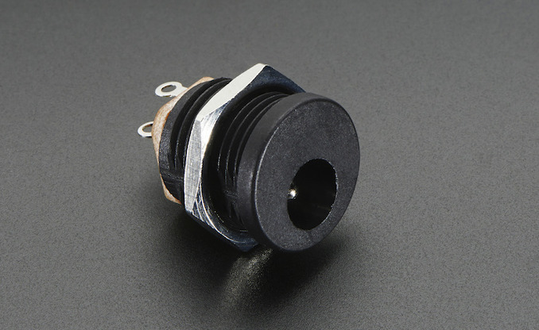
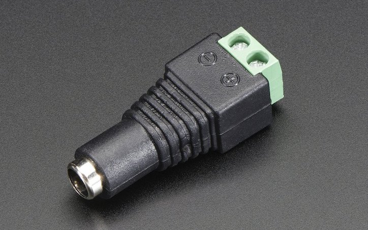
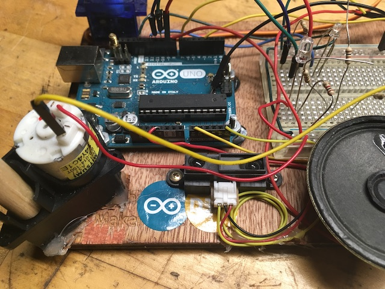

## Electronic Project Construction Techniques
After an electronic project (with or without Arduino) has been prototyped and all the bugs have been worked out, the next step should be to construct it in a way that is robust, reliable, and safe. For example, you’d like to hand your project to someone and not have to say “don’t move this and don’t touch here”.

In this tutorial we will discuss some of these construction techniques.

### Contents
 - [Why Should I Care?](#why-should-i-care)
 - [Get off the Solderless Breadboard](#Get-off-the-Solderless-Breadboard)
 - [Don’t Solder Modules to your Board, part 1](#dont-solder-modules-to-your-board-part-1)
 - [Don’t Solder Wires to your Board, part 2](#dont-solder-modules-to-your-board-part-2)
 - [Disadvantage to the above two methods](#disadvantage-to-the-above-two-methods)
 - [Don’t Use Solid Core Wire](#dont-use-solid-core-wire)
 - [Strip Wires as Little as Possible](#strip-wires-as-little-as-possible)
 - [Use Heat Shrink Tubing Instead of Electrical Tape](#use-heat-shrink-tubing-instead-of-electrical-tape)
 - [Wire Colors Matter](#wire-colors-matter)
 - [Use the Right Wire Thickness](#use-the-right-wire-thickness)
 - [Multi Conductor Cable](#multi-conductor-cable)
 - [Wire Dressing](#wire-dressing)
 - [Power Connectors](#power-connectors)
 - [Strain Relief](#strain-relief)

### Why Should I Care?
 - Very simply: To make sure your project works.
   - 90% of the time when I am called to fix a formerly working project, it is either because a wire has become disconnected, or a connection has occurred where it shouldn’t.
   - Following these steps will help prevent this from happening and, if it does happen, will make it easier to find and fix the problem.

### Get off the Solderless Breadboard
- The solderless breadboard is great for prototyping, but it is very unreliable.
  - You have probably experienced wires or components falling out during transportation, or being pulled out accidentally when moving around.
  - Your circuit needs to be soldered. There are multiple approaches to this:
    - If your circuit connects to an Arduino, consider using an Arduino Prototyping Shield, such as [this one](https://store.arduino.cc/usa/proto-shield-rev3-uno-size) from Arduino. These are available from other vendors as well, with slight variations that you might find advantageous. What they all have in common are places for the pins that plug right into an Arduino, and a large undedicated perforated area for you to build your circuit.
    - If your circuit does not connect to Arduino, use a [perforated breadboard](https://en.wikipedia.org/wiki/Perfboard) (also called prototyping board or perf board) of your choice, such as [Perma-Proto boards](https://www.adafruit.com/category/466) from Adafruit which provide the connections and form factor of your solderless breadboard and might be easier for beginners.
    - There are thousands of other sizes and some different shapes (e.g. round or oval). You also have a choice as to whether there are any [pre-made connections](http://www.busboard.com/PR3UC) or [not](http://www.busboard.com/PAD1).
      - [Perf boards](https://www.allelectronics.com/category/455/perf-boards/1.html) are available from most electronics suppliers
    - For a more professional circuit, design and make your own printed circuit board (PCB), for example using [Fritzing and an Othermill](https://web.archive.org/web/20170723212431/http://teachmetomake.com/wordpress/using-fritzing-to-design-an-arduino-shield-and-using-othermill-to-mill-the-board).
    - You can also send your design to various companies that will make your PCB for you, such as [ExpressPCB](http://www.expresspcb.com/)

### Don’t Solder Modules to your Board, part 1
Whatever technique you use to construct your circuit, you should avoid soldering any modules or sensors
([Real Time Clocks](https://www.adafruit.com/products/264), [Bluetooth modules](https://www.adafruit.com/products/2633), etc.) to your board. Instead, solder the mating header (male or female) to your board, and plug the modules into the header:

Similarly, sensors should attached with headers, not directly soldered to your board. This makes it much easier to replace a damaged sensor or swap sensors quickly for testing:

  - Exceptions:
    - Space constraints
    - Extreme vibration (e.g. model rocket) requires something that can’t fall out

 - Note that you can get right angle headers if you prefer.
 - Use a silver Sharpie or paint pen to indicate which way to plug in, to avoid plugging it in backwards

### Don’t Solder Wires to your Board, part 2

- As with modules, you should avoid soldering wires directly to your board.
  - Instead, solder the wires to headers (male or female) and solder a mating header to your board:
    - Use a silver Sharpie to indicate which way to plug in, to avoid plugging it in backwards

  - If your wire is too thick to solder to header pins, use screw terminals instead:

### Disadvantage to the above two methods
 - What happens if you plug the wires or module in the wrong way?
   - If you’re lucky, nothing, it simply doesn’t work.
   - But some devices will be damaged permanently by this. It is crucial to know the right way to plug things in.
     - smart designers arrange their sensor connections to avoid applying reverse power.
       - the simple trick is to put positive voltage in the middle, with ground and output on the outsides (of a 3 pin connection)
       - at worst, this kind of connection grounds out the input when plugged in backwards, but no damage results! (typically)
     - Servo connections are arranged in this manner:

         

   - Always put the black wire (ground) on one side of the connector, and indicate where the ground should go.
   - You can also print a label and glue it to the connectors or your board.
   - For screw terminals, use clear heat shrink to fix labels around the wires and tape or glue labels on the board.

 - An alternative, especially for power connectors, is to use polarized barrel connectors, e.g. this [jack](https://www.adafruit.com/product/373) and corresponding [plug](https://www.adafruit.com/products/369):

 - Molex connectors are another type of connector that can only be plugged in one way

 

 

 - Many other connectors exist, offering various benefits
  - weatherproof
  - locking
  - cool-looking
  - multiple connections
  
  
    
      
        

### Don’t Use Solid Core Wire
 - Up to now you used solid core wire or manufactured jumpers because they were easy to plug into your solderless breadboard.
   - Solid core wire has a severe disadvantage: it is brittle and breaks easily when bent more than a few times.
   - Even worse, soldering will create a stress point right where the wire meets the solder, making it much more likely to break.
   - For this reason, you should always use stranded wire in any situation where the wire will move.
     - The only exception to this rule is:
       - Wires that are soldered from one point on a board to another point on the same board:

       

 - So what do you do if you need to attach a stranded wire to a solderless breadboard? Solder a small piece of solid core wire to the stranded wire, and dress it nicely with heat shrink tubing (just like the manufactured jumpers):

 

### Strip Wires as Little as Possible
 - Wires that are stripped longer than necessary leave exposed metal that might touch another wire, causing a short circuit.
 - To avoid this, wires should be stripped no longer than whatever they are connected to.
 - For example, when soldering wires to the short side of header pins, strip the wire to this length. In fact, it is usually easier to strip the wire longer, tin the wire, and then trim it to the desired length.

  

### Use Heat Shrink Tubing Instead of Electrical Tape
- Heat shrink tubing is preferred to electrical tape
  - it stays in place better and can be removed by a single cut with sharp knife.
  - clear heat shrink tubing allows you to see that connections are intact:

  

- Colored heat shrink tubing can also be used to color-code wires, such as red for positive and black for negative

### Wire Colors Matter
 - Use red only for positive voltage (usually +5V)
 - use black only for GND.

 - Use only the other colors for any other signals.
   - it may be useful to come up with color scheme to help you keep your wiring organized

 - Exceptions:
	 - Something that comes pre-wired with colors that you can’t control. In this case use heat shrink tubing to indicate the color you want it to be. If you can’t find heat shrink tubing in the color you need, use white heat shrink tubing and color it properly with a permanent marker.

### Use the Right Wire Thickness
 - Wire thickness is specified in AWG or gauge.
   - Thicker wires have smaller gauge numbers.
    - Thinner wire takes up less space but tears easily
    - thicker wire is strong but is hard to work with.
 - The most common wire we use is 22 AWG as it’s a good balance of these features.

 - If your project uses a lot of current, e.g. a heavy robot, you might need thicker wire (smaller gauge number) for the wires that carry that current, e.g. from the battery to the speed controller and then to the motor.
 - The rest of the electronics don’t need thicker wire because they carry much less current.

### Multi Conductor Cable
If you have multiple wires going between visible parts of your project, consider using multiple conductor cable:

### Wire Dressing
The expression wire dressing refers to organizing and bundling wires neatly. This project for example is not well dressed:

This is an example of good cable dressing:

Note the loops of wire – this is always a good idea. It allows for necessary slack when disconnecting a wire for any reason

### Power Connectors
- Most power supplies come with round connectors that are called barrel - or coax - connectors:

- These are a little awkward to bring into projects.
  - You might make use of a panel jack, something like [this](https://www.adafruit.com/product/610):

- or [this](https://www.adafruit.com/product/368) female screw terminal connector:

- If these connectors are such a nuisance why are they used? Because they are polarized, meaning you can’t plug them in backwards.
  - One big disadvantage of using header pins or screw terminals is nothing prevents you from putting the wrong wire in the wrong place.

### Strain Relief
Whenever wires leave a board or an enclosure think about what might happen if the wire gets yanked. The way to prevent this is to anchor the wire in some way. In this image a pair of holes have been cut near where the wire exits the box, and a zip tie is used to anchor the wire to the box:

In this project a knot is tied in the wire before it leaves the box, and the knot is glued to the box as well:

Here a ziptie is used to prevent the wire from pulling on something potentially delicate inside the box:

Some more examples of strain relief

### Sudhu's Minaret Boards and YEMRS wiring - for discussion

