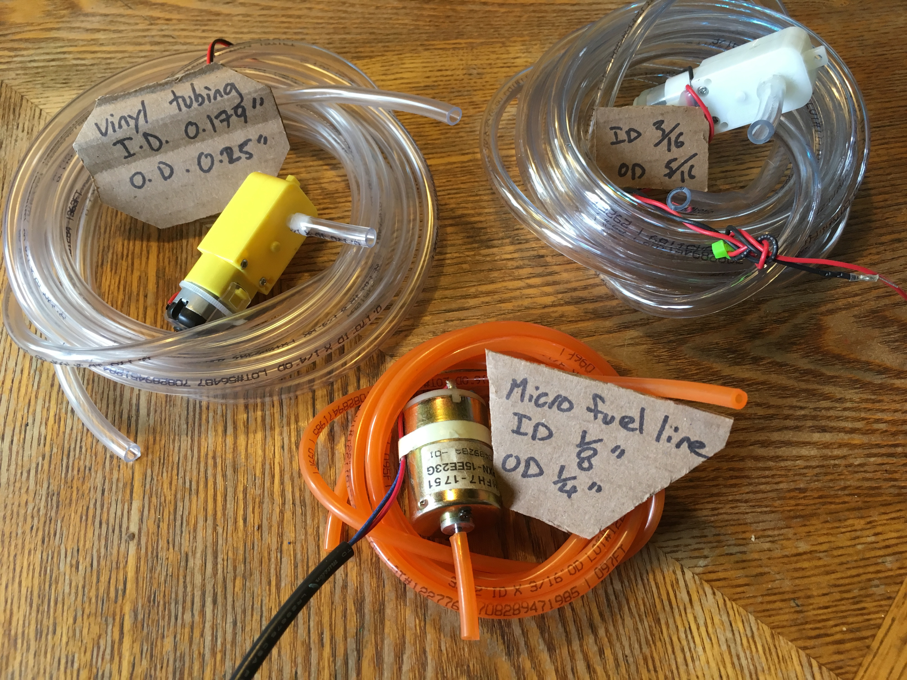
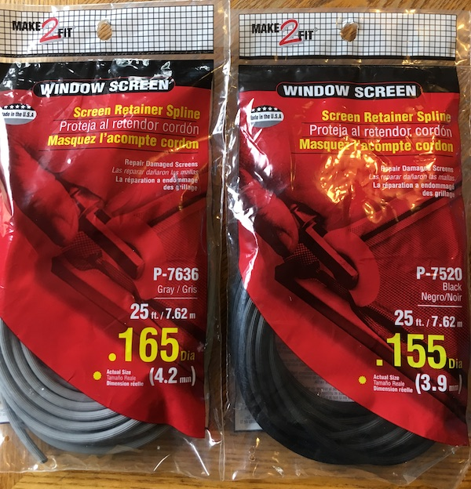

  
Most hardware stores will have a selection of tubing which you can purchase by the foot. Different sizes work for different motors. 
  
 

"Spline" for repairing screen windows and doors is generally a good fit for hobby motors.

Spline works well to give traction for the toy motors used on [Beetlebots](https://makezine.com/projects/make-12/beetlebots/)
