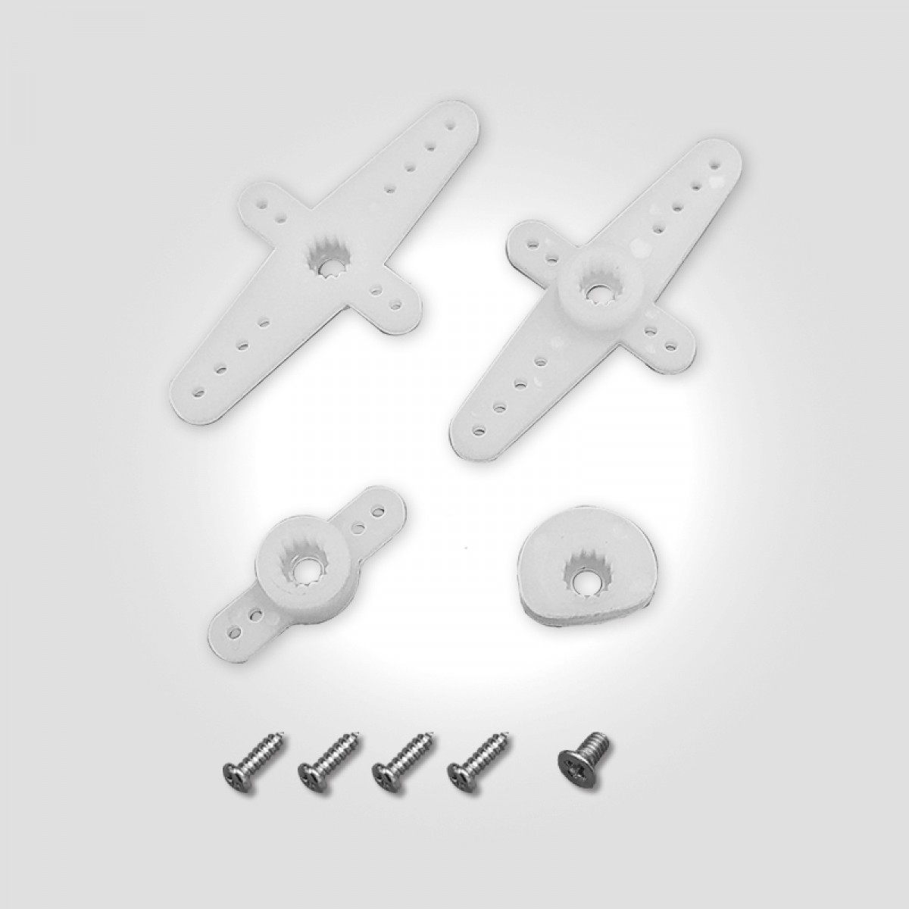
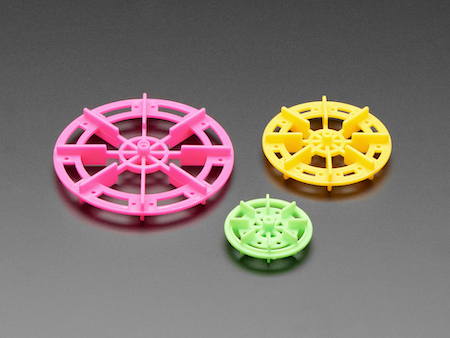
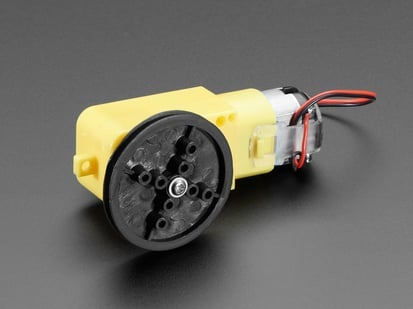

## use Servo horns for servo motors!

<!--  -->

## use manufactured solutions for connecting to TT motors!

<!--  -->

<!--  -->

[Adafruit TT motor wheels](https://www.adafruit.com/search?q=TT+motor+wheel)

## DIY - get a robot to make connectors for you!

Search for models tagged “TT motor”

Thingiverse: https://www.thingiverse.com/search?q=TT+motor

Printables (Prusa): https://www.printables.com/search/models?q=TT+motor

Makerworld (Bambu): https://makerworld.com/en/search/models?keyword=TT+motor

## DIY Shaft Couplers from Hardware Store Tubing!
  
Most hardware stores will have a selection of tubing which you can purchase by the foot. Different sizes work for different motors. 
  
 

 

"Spline" for repairing screen windows and doors is generally a good fit for the tiny shaft of small hobby motors.

Spline works well to give traction for the small toy motors used on [Beetlebots](https://makezine.com/projects/make-12/beetlebots/)

## DIY Shaft Couplers - make one!

Drill a centered hole in a small piece of cylindrical material to use as a coupler between your motor shaft and and axle.

Check out the technique described in this blog post for drilling a centered hole in a piece of cylindrical material to be used as a shaft coupler: http://www.thebitbangtheory.com/2013/05/high-torque-encoded-dc-motors-robots-car-window-motors/

## Manufactured Shaft Couplers - buy one

[McMaster Carr - Shaft Coulings](https://www.mcmaster.com/shaft-couplings/)
[Grainger Shaft Coulings](https://www.grainger.com/category/power-transmission/shaft-couplings-collars-and-universal-joints)
[NBK Shaft Couplings:](https://www.nbk1560.com/en-US/products/coupling/couplicon/?gclid=Cj0KCQiAoY-PBhCNARIsABcz773Dp9iZv4wEpHo0CxMjjO2Ldcx8zSvrPdtyZYVgNO41UH2fVYFc_aYaAq2LEALw_wcB)

