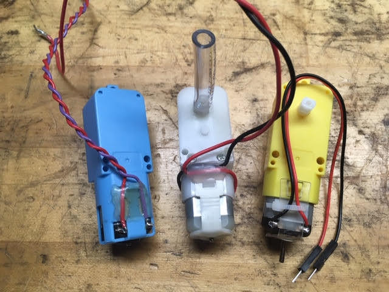

## Strain Relief!
  
Making sure that your delicate electrical connections don't get yanked out is a great idea! 
 

Use hot glue or zipties 

(Hot glue doesn't work well if you are in a hot place (like the desert) or it the motor is running hard enough to get hot).

